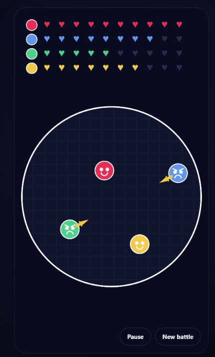
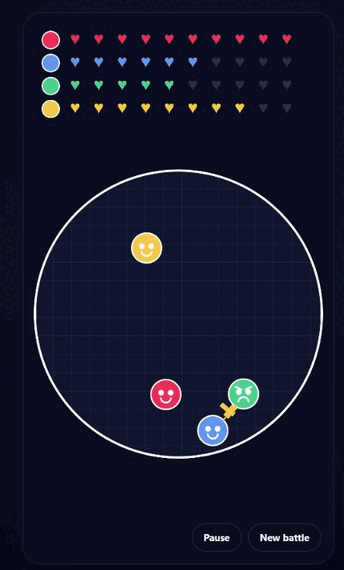

# Ball Battles

A simple browser game based on battles between two or more balls using different types of weapons.

Created based on videos from the [@3d_animation_1610](https://www.instagram.com/3d_animation_1610/) account.

## Preview



### Gameplay



## Running the Game

```powershell
npm install
npm start
```

After starting the server, open `http://127.0.0.1:4173`.

## Changing the IP Address and Port

If desired, you can change the default IP address and port by creating a `.env` file with the following contents:

```text
HOST=[IP address]
PORT=[Server port]
```

Then start the server:

```bash
npm run serve
```

## Mechanics

- At the beginning of the game, between two and six balls can be selected;
- Individual weapon types and healing hearts can be enabled or disabled before the battle;
- The balls move and collide elastically inside a circular arena;
- Assault rifles, Uzis, shotguns, pistols, knives, and shields randomly appear in the arena;
- Weapons automatically aim at opponents;
- Successful hits reduce health, while shields can block several attacks;
- The battle can be paused or restarted.

## Using the Game in Another Project

Another developer can integrate the game into an existing website without using the included Node.js server:

1. Copy `src/main.ts` into the project's source directory.
2. Copy the game-related markup from `index.html`, including the `#game` canvas, setup panel, and control buttons.
3. Copy the relevant styles from `styles.css`.
4. Compile `src/main.ts` with TypeScript or include it in the project's existing build pipeline.
5. Make sure the compiled JavaScript is loaded as an ES module after the required HTML elements are available.

The script expects a `1080 × 1920` canvas with the ID `game`, as well as elements with the IDs `setup`, `start`, `toggle`, and `restart`. The canvas is scaled responsively through CSS, so its internal resolution should remain unchanged. Audio is generated with the browser's Web Audio API and requires no external sound files.

If the target project already has its own server or framework, `server.js` is optional. Only the browser assets and compiled game code need to be served.
